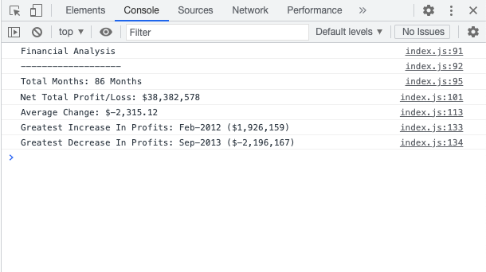

# Console-Finances

# Desciption

## This project invovled me building a portfolio for the previous front end development work I have done. This project in particular was built using bootstrap 4.3 components. It consists of 4 major parts, the inital jumbotron section, the about me section, my work section and the contact section.

# Usage

## You can access the page via this link: https://hoggi90.github.io/Console-Finances/

## Right-click on the browser and choose inspect, then click on console to view the result.

# Screenshot

